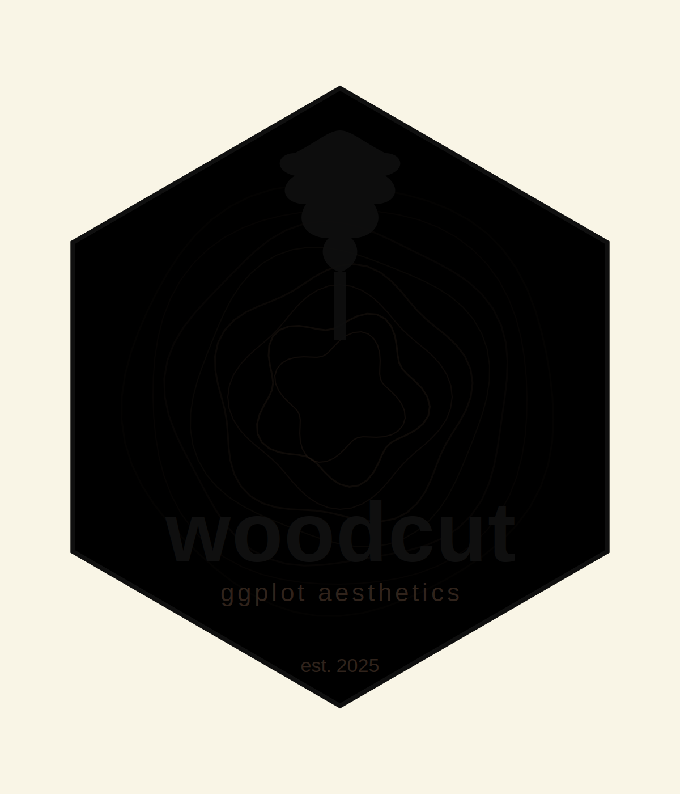

<!-- README.md is generated from README.Rmd. Please edit that file -->

```{r, include = FALSE}
knitr::opts_chunk$set(
  collapse = TRUE,
  comment = "#>",
  fig.path = "man/figures/",
  out.width = "100%"
)
```

# woodcut 

<!-- badges: start -->
<!-- badges: end -->

Personal aesthetic helpers for ggplot2 

---

## Installation

You can install the development version of aes from [GitHub](https://github.com/) with:

```{r}
# install.packages("pak")
devtools::install_github("brownegm/aes")
```

## Quick start

```{r}
library(ggplot2)
library(woodcut)

ggplot2::ggplot(mtcars, aes(wt, mpg, color = factor(cyl))) +
  geom_point(size = 3, alpha = 0.9) +
  labs(x = "Weight", y = "MPG", color = "Cylinders") +
  theme_woodcut() +
  scale_color_woodcut(palette = "get.out")
```

## What’s inside

- `theme_woodcut()` — high-contrast, print-like look with generous text and panel spacing.
- `scale_color_woodcut()` / `scale_fill_woodcut()` — discrete and continuous palettes: 
```{r}
# print palette names
woodcut::woodcut_palettes(plot = TRUE)
```

