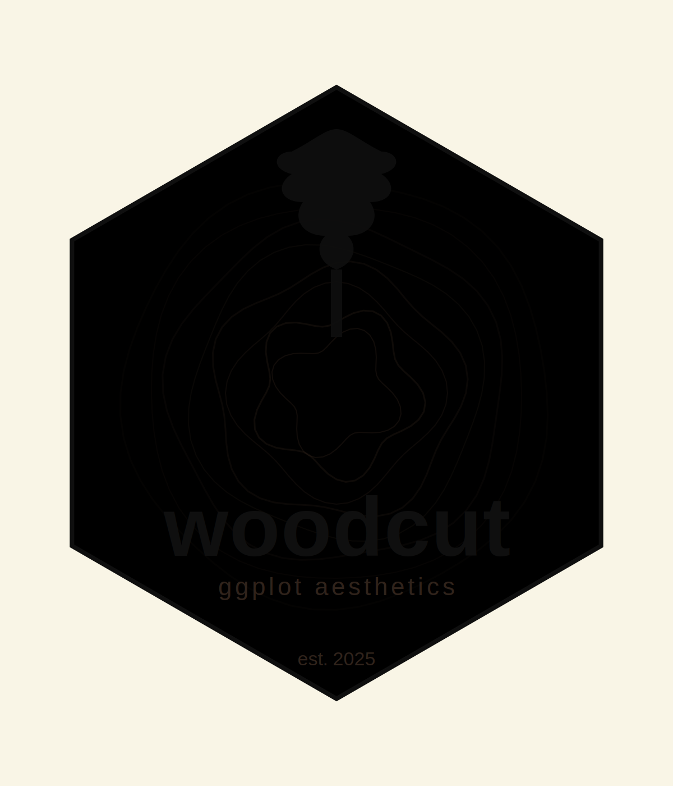
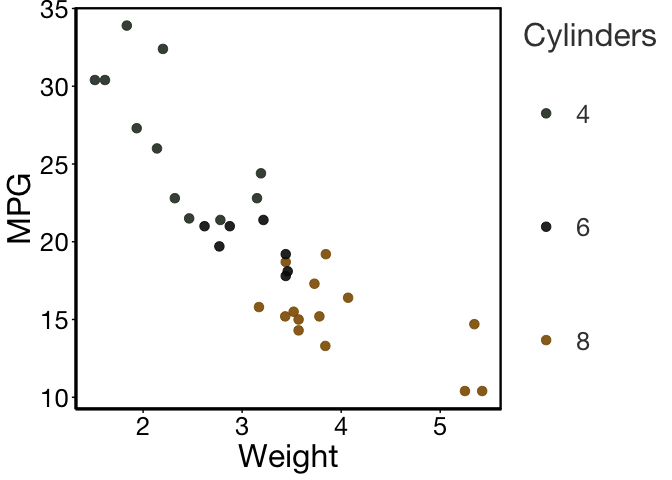
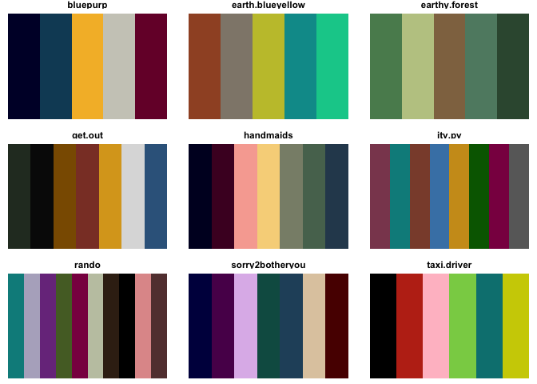

<!-- README.md is generated from README.Rmd. Please edit that file -->

# woodcut 

<!-- badges: start -->

<!-- badges: end -->

Personal aesthetic helpers for ggplot2

------------------------------------------------------------------------

## Installation

You can install the development version of aes from
[GitHub](https://github.com/) with:

``` r
# install.packages("pak")
devtools::install_github("brownegm/aes")
#> Warning in gitcreds_get_cache(cache_ev): Invalid gitcreds credentials in env
#> var `GITHUB_PAT_GITHUB_COM`. Maybe an unescaped ':' character?
#> Warning in gitcreds_get_cache(cache_ev): Invalid gitcreds credentials in env
#> var `GITHUB_PAT_GITHUB_COM`. Maybe an unescaped ':' character?
#> Skipping install of 'aes' from a github remote, the SHA1 (7cf66cd4) has not changed since last install.
#>   Use `force = TRUE` to force installation
```

## Quick start

``` r
library(ggplot2)
library(woodcut)

ggplot2::ggplot(mtcars, aes(wt, mpg, color = factor(cyl))) +
  geom_point(size = 3, alpha = 0.9) +
  labs(x = "Weight", y = "MPG", color = "Cylinders") +
  theme_woodcut() +
  scale_color_woodcut(palette = "get.out")
```



## What’s inside

- `theme_woodcut()` — high-contrast, print-like look with generous text
  and panel spacing.
- `scale_color_woodcut()` / `scale_fill_woodcut()` — discrete and
  continuous palettes:

``` r
# print palette names
woodcut::woodcut_palettes(plot = TRUE)
```



    #> $bluepurp
    #> [1] "#000033" "#104a65" "#f4ba32" "#cccbc1" "#770a35"
    #> 
    #> $earth.blueyellow
    #> [1] "#a0522d" "#90877a" "#c4c237" "#009999" "#00cc99"
    #> 
    #> $earthy.forest
    #> [1] "#5a8b5d" "#bec991" "#907350" "#5f8971" "#36563e"
    #> 
    #> $rando
    #>  [1] "darkcyan"       "#B4B0C6"        "mediumorchid4"  "darkolivegreen"
    #>  [5] "deeppink4"      "#C2C6B0"        "#3a2716"        "black"         
    #>  [9] "#e09999"        "#643E3E"       
    #> 
    #> $get.out
    #> [1] "#2A372A"    "gray3"      "orange4"    "coral4"     "goldenrod" 
    #> [6] "gainsboro"  "steelblue4"
    #> 
    #> $sorry2botheryou
    #> [1] "#00004C" "#590059" "#DFBAEA" "#0E5A51" "#26506A" "#DFCAAE" "#590000"
    #> 
    #> $taxi.driver
    #> [1] "black"   "#BE3019" "#FFC0CB" "#89CF53" "#008080" "#CECE00"
    #> 
    #> $handmaids
    #> [1] "#000028" "#4B0629" "#F7ABA1" "#F7D488" "#898E78" "#57725D" "#2C475C"
    #> 
    #> $itv.pv
    #> [1] "palevioletred4" "darkcyan"       "salmon4"        "steelblue"     
    #> [5] "goldenrod3"     "darkgreen"      "deeppink4"      "gray41"
